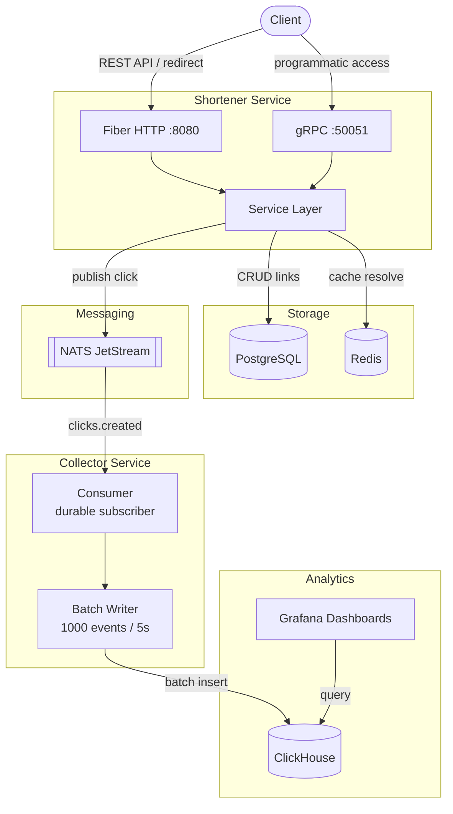
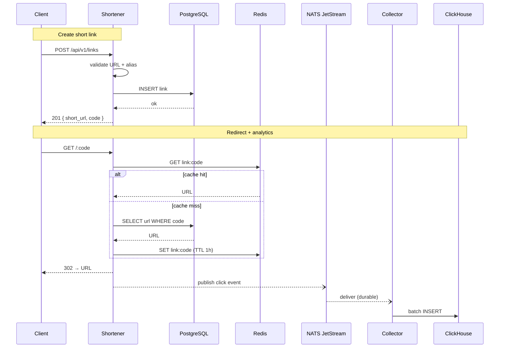
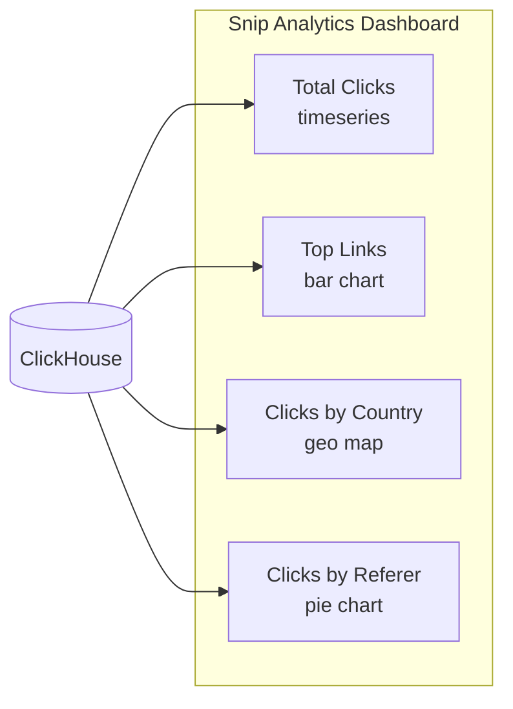

# Snip — Distributed URL Shortener

A distributed URL shortener built with Go, showcasing microservice architecture with gRPC, NATS JetStream, ClickHouse, and Grafana.

## Architecture



## Data Flow



## Tech Stack

| Component | Technology | Purpose |
|-----------|-----------|---------|
| **API** | Go, Fiber | HTTP REST endpoints |
| **RPC** | gRPC, Protobuf | Programmatic access |
| **Database** | PostgreSQL | Link storage |
| **Cache** | Redis | Hot link resolution (TTL 1h) |
| **Messaging** | NATS JetStream | Durable click event delivery |
| **Analytics** | ClickHouse | Click event OLAP storage |
| **Dashboards** | Grafana | Real-time analytics UI |
| **Deploy** | Docker Compose, K8s | Local dev & production |

## Quick Start

### Prerequisites

- Go 1.23+
- Docker & Docker Compose

### Run

```bash
# Start infrastructure (postgres, redis, nats, clickhouse, grafana)
make docker-up

# Run shortener API (terminal 1)
make run-shortener

# Run analytics collector (terminal 2)
make run-collector
```

### Services

| Service | URL | Credentials |
|---------|-----|-------------|
| HTTP API | http://localhost:8080 | — |
| gRPC | localhost:50051 | — |
| Grafana | http://localhost:3000 | admin / admin |
| NATS monitoring | http://localhost:8222 | — |

## API

### HTTP Endpoints

| Method | Path | Description | Response |
|--------|------|-------------|----------|
| `POST` | `/api/v1/links` | Create short link | `201` |
| `GET` | `/:code` | Redirect to original URL | `302` |
| `GET` | `/api/v1/links/:code` | Get link info | `200` |
| `DELETE` | `/api/v1/links/:code` | Delete link | `204` |
| `GET` | `/api/v1/health` | Health check | `200` |

### Examples

```bash
# Create link (auto-generated code)
curl -s -X POST http://localhost:8080/api/v1/links \
  -H "Content-Type: application/json" \
  -d '{"url": "https://github.com"}' | jq

# Create link (custom alias)
curl -s -X POST http://localhost:8080/api/v1/links \
  -H "Content-Type: application/json" \
  -d '{"url": "https://github.com", "custom_alias": "gh"}' | jq

# Follow redirect
curl -L http://localhost:8080/gh

# Get link info
curl -s http://localhost:8080/api/v1/links/gh | jq

# Delete
curl -X DELETE http://localhost:8080/api/v1/links/gh
```

### gRPC

```protobuf
service Shortener {
  rpc CreateLink(CreateLinkRequest)   returns (Link);
  rpc ResolveLink(ResolveLinkRequest) returns (Link);
  rpc DeleteLink(DeleteLinkRequest)   returns (google.protobuf.Empty);
}
```

## Validation

| Field | Rule |
|-------|------|
| `url` | Required. Absolute `http://` or `https://` with host |
| `custom_alias` | Optional. `[a-zA-Z0-9]{1,12}` |
| Auto-generated code | 6-char base62, retry on collision (max 5) |

## Grafana Dashboards



Open http://localhost:3000 (admin/admin) after `make docker-up`.

## Project Structure

```
snip/
├── cmd/
│   ├── shortener/        # HTTP + gRPC server
│   └── collector/        # NATS consumer → ClickHouse
├── internal/
│   ├── shortener/
│   │   ├── handler.go    # Fiber HTTP handlers
│   │   ├── grpc.go       # gRPC server
│   │   ├── service.go    # Business logic, validation
│   │   ├── repository.go # PostgreSQL queries
│   │   └── cache.go      # Redis cache layer
│   ├── collector/
│   │   ├── consumer.go   # JetStream durable subscriber
│   │   └── writer.go     # ClickHouse batch writer + retry
│   └── common/
│       ├── config.go     # Env-based config
│       └── logger.go     # Structured logging (slog)
├── proto/                # Protobuf definitions + generated code
├── migrations/
│   ├── postgres/         # Links table DDL
│   └── clickhouse/       # Click events table DDL
├── grafana/              # Dashboard JSON + provisioning
├── deployments/
│   ├── docker-compose.yml
│   └── k8s/              # Kubernetes manifests
├── Dockerfile            # Multi-stage (shortener + collector)
├── Makefile
└── go.mod
```

## Development

```bash
make build          # Build both binaries
make test           # Run tests with race detector
make lint           # golangci-lint
make proto          # Regenerate protobuf code
make docker-up      # Start infrastructure
make docker-down    # Stop infrastructure
```

## Design Decisions

| Decision | Rationale |
|----------|-----------|
| **Fiber** over net/http | Lower boilerplate, high performance |
| **slog** for logging | Stdlib, zero dependencies |
| **Base62** codes (6 chars) | 56B combinations, URL-safe |
| **NATS JetStream** | Durable delivery, replay on collector restart |
| **ClickHouse MergeTree** | Optimized for time-series analytics, partitioned by month |
| **Redis TTL 1h** | Hot links cached, cold links fall through to PG |
| **302 Found** redirect | Browser doesn't cache permanently (unlike 301) |
